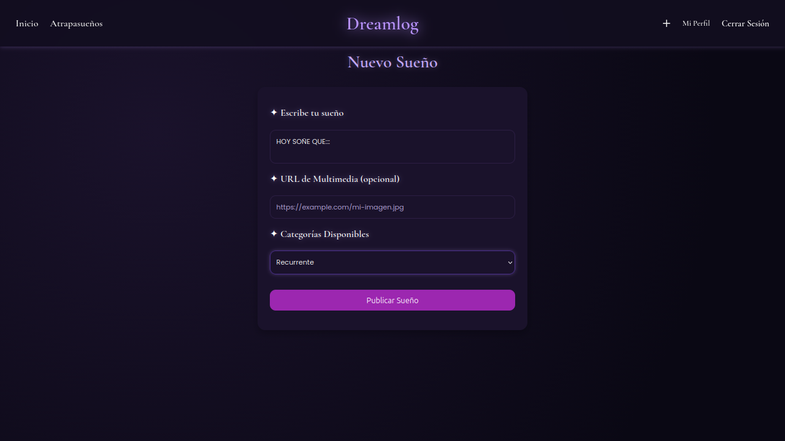

# 🌙 Dreamlog
**Dreamlog** es una plataforma para registrar y organizar tus sueños recientes. Funciona como un diario personal de sueños, permitiendo mantener un historial, clasificarlos mediante categorias y consultarlos cuando quieras. 


## 📖 Descripción 
Dreamlog permite a los usuarios:
- Crear una cuenta personal y elegir un animal espiritual de compañia.
- Registrar sueños recientes de forma rápida y sencilla.  
- Mantener un historial personal de sueños.  
- Clasificar y organizar los sueños mediante categorias. 
- Consultar y reflexionar sobre los sueños anteriores.
- Recibir "Lunas" de parte de otros usuarios.
- Un atrapasueños personalizado para cada usuario en el cual poodrá ver su pogreso en la página.
**Dreamlog** es ideal para quienes quieren llevar un diario de sueños, reflexionar sobre ellos o simplemente no olvidarlos.


## 👤 Integrantes
- [Magali Karen Huertas](https://github.com/mhuertas269)
- [Brenda Choque](https://github.com/Bren-Ch)
- [Arianna Perez Ochoa](https://github.com/ari-pz)


## ⭐ Requisitos previos
Antes de levantar el proyecto, asegurate de tener instalados:
- [Node.js](https://nodejs.org/) (v18 o superior)  
- [npm](https://www.npmjs.com/)  
- [Docker](https://www.docker.com/) y [Docker Compose](https://docs.docker.com/compose/)  


## 🛠️ Instalación
1. **Clonar el repositorio**
```bash
git clone git@github.com:ari-pz/dreamlog.git
```
2. **Instalar dependencias del backend**
```bash
cd dreamlog
cd backend
npm install
```
3. **Levantar la base de datos y el Backend**
```bash
cd ..
make dev
```

## 📸 Capturas de pantalla

**Ingresar/Registrarse**


**Inicio**


**Atrapasueños**


**Perfil de Usuario**


**Nuevo Sueño**



