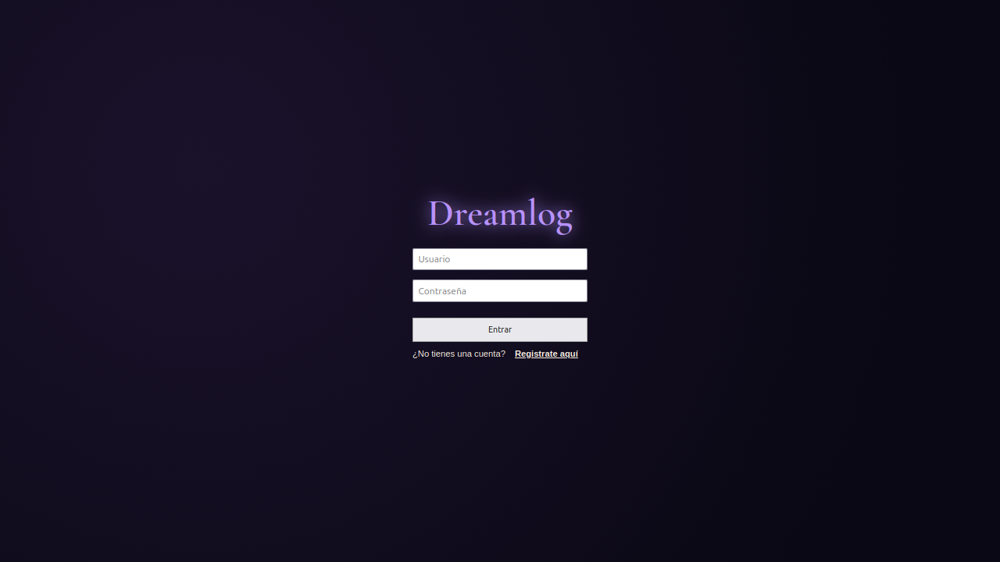
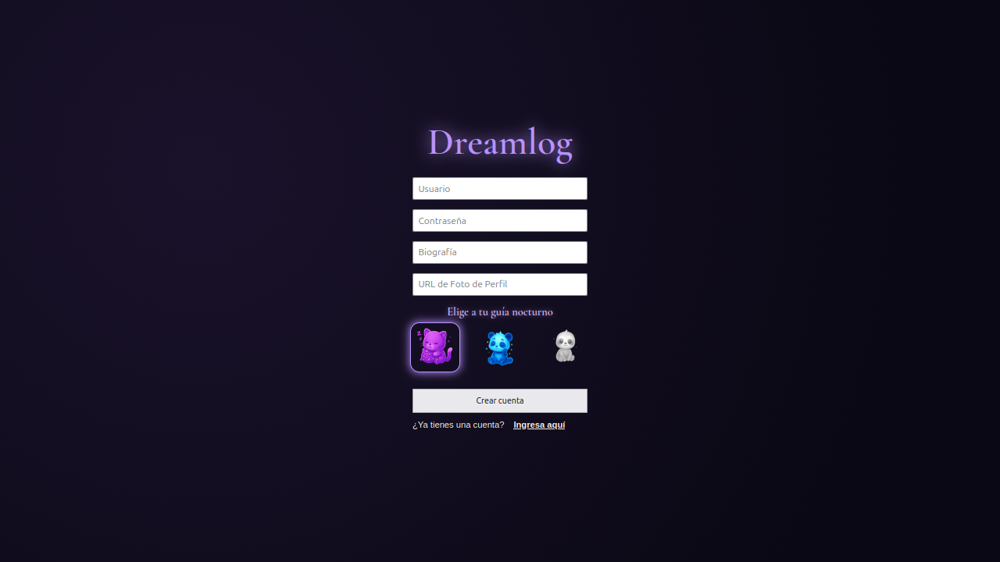
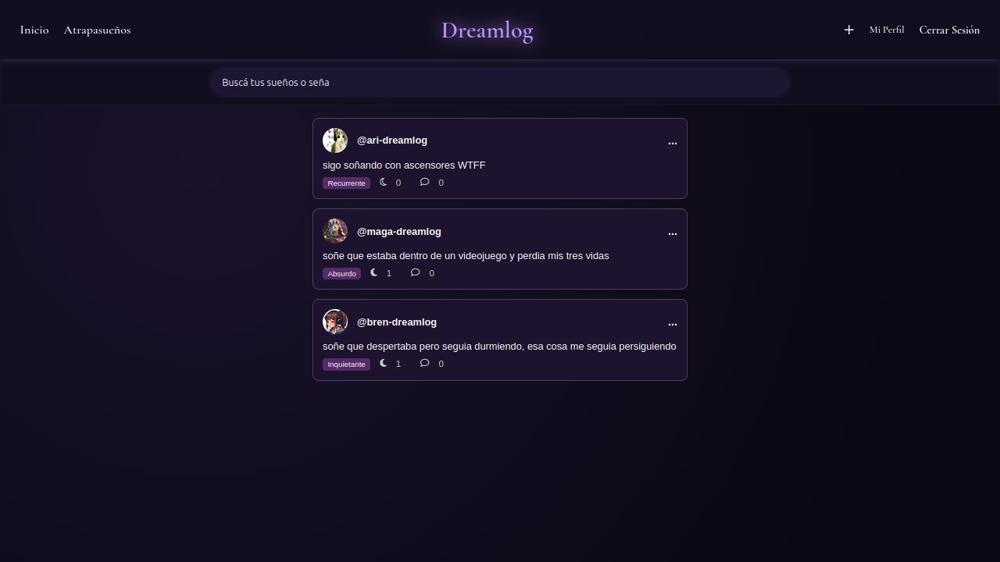
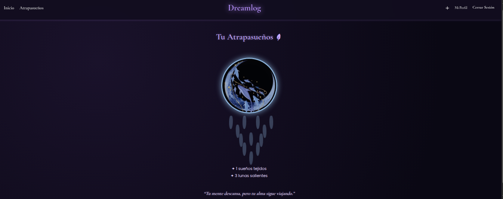
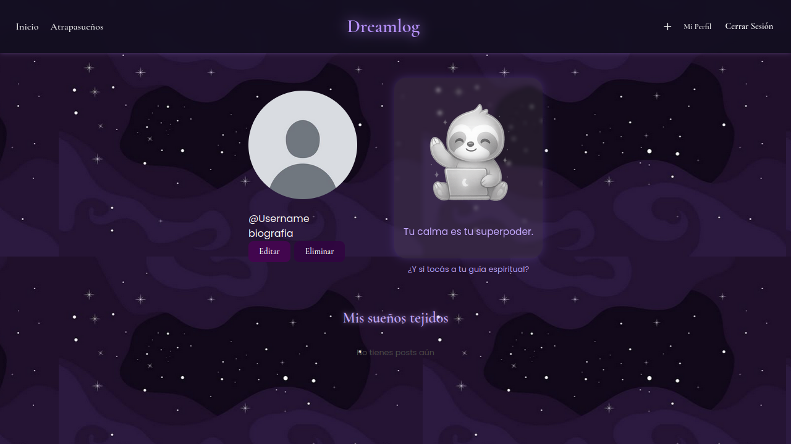
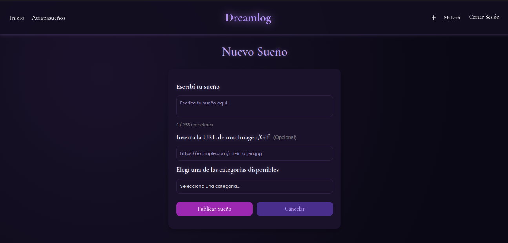

# 🌙 Dreamlog
**Dreamlog** es una plataforma para registrar y organizar tus sueños recientes. Funciona como un diario personal de sueños, permitiendo mantener un historial, clasificarlos mediante categorias y consultarlos cuando quieras. 


## 📖 Descripción 
Dreamlog permite a los usuarios:
- Crear una cuenta personal y elegir un animal espiritual de compañia.
- Registrar sueños recientes de forma rápida y sencilla.  
- Mantener un historial personal de sueños.  
- Clasificar y organizar los sueños mediante categorias. 
- Consultar y reflexionar sobre los sueños anteriores.
- Recibir "Lunas" de parte de otros usuarios.
- Un atrapasueños personalizado para cada usuario en el cual poodrá ver su pogreso en la página.
**Dreamlog** es ideal para quienes quieren llevar un diario de sueños, reflexionar sobre ellos o simplemente no olvidarlos.


## 👤 Integrantes
- [Magali Karen Huertas](https://github.com/mhuertas269)
- [Brenda Choque](https://github.com/Bren-Ch)
- [Arianna Perez Ochoa](https://github.com/ari-pz)


## ⭐ Requisitos previos
Antes de levantar el proyecto, asegurate de tener instalados:
- [Node.js](https://nodejs.org/) (v18 o superior)  
- [npm](https://www.npmjs.com/)  
- [Docker](https://www.docker.com/) y [Docker Compose](https://docs.docker.com/compose/)  


## 🛠️ Instalación
1. **Clonar el repositorio**
```bash
git clone git@github.com:ari-pz/dreamlog.git
cd dreamlog
```
2. **Levantar el backend y base de datos**
```bash
cd backend
npm install
```

2. **Levantar el proyecto con Docker**
```bash
docker compose up --build
```

## 🧱 Arquitectura del sistema

Dreamlog está desarrollado siguiendo una arquitectura en tres capas, desacopladas mediante Docker Compose:

FRONTEND
- Sitio estático servido mediante Nginx.
- Se comunica con el backend mediante solicitudes fetch() a la API REST.
- Se ejecuta en un contenedor independiente.

BACKEND
- API REST desarrollada en Node.js con Express.
- Expone endpoints bajo el prefijo /api.
- Maneja la conexión con la base de datos.
- Devuelve datos en formato JSON.
- Se ejecuta en un contenedor independiente.

BASE DE DATOS
- Motor PostgreSQL.
- Contiene las entidades principales del sistema: Users, Posts, Categories, Lunas
- Utiliza claves foráneas para definir relaciones entre entidades.

## 🔗 Comunicación entre servicios

Flujo de una solicitud: 

1) El usuario accede al frontend en http://localhost:3000.
2) Nginx sirve los archivos estáticos (HTML, CSS, JS).
3) El frontend realiza una solicitud fetch() a /api/....
4) Nginx redirige esa solicitud al contenedor del backend.
5) El backend procesa la lógica y consulta PostgreSQL.
6) PostgreSQL devuelve los datos.
7) El backend responde en formato JSON.
8) El frontend renderiza dinámicamente la información.

## 📸 Capturas de pantalla

**Ingresar/Registrarse**



**Inicio**


**Atrapasueños**


**Perfil de Usuario**


**Nuevo Sueño**


